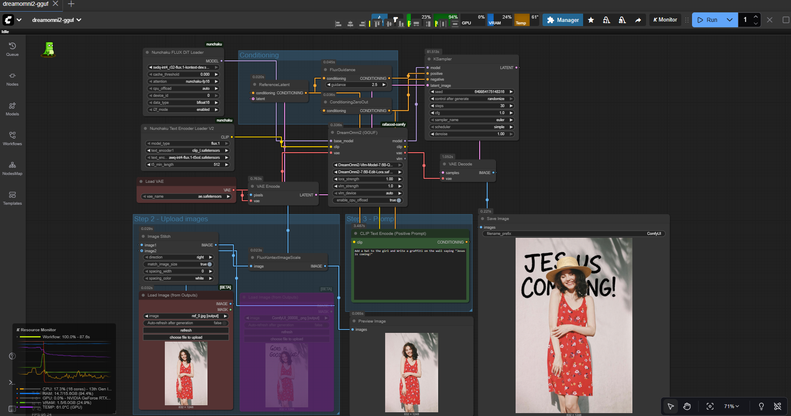
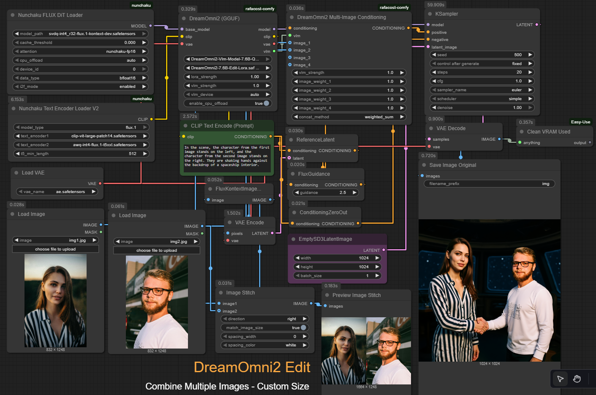

# ComfyUI-DreamOmni2-GGUF

A **ComfyUI custom node** to run **DreamOmni2 GGUF** models directly in ComfyUI.  

⚠️ **This is a Work In Progress Download at your own risk!** ⚠️<br/>
<sub>(Or help us to develop it if you really want 😁...)</sub>

### Generation Lora


### Edit Lora


For the workflow drag and drop this image:


---

## Features

- Load and run DreamOmni2 GGUF models in ComfyUI.
- Supports image-to-image and text-to-image pipelines.
- Works with quantized GGUF models for efficiency.

---

## Installation

1. Clone your repository into your ComfyUI `custom_nodes` folder:

```bash
git clone https://github.com/rafacost/rafacost-comfy.git
```

2. Download the model and loras from my huggingface [here](https://huggingface.co/rafacost/DreamOmni2-7.6B-GGUF)

3. Place your DreamOmni2 GGUF model and lora files into:
```bash
ComfyUI/models/unet
ComfyUI/models/loras
```
---
## Usage

1. Start ComfyUI.
2. Add the DreamOmni2 GGUF node from the node list.
3. Connect your inputs (prompt, image, etc.) and run the pipeline.

---
## Example

Use the provided examples/image.png to test the node.


---
### Notes

- Since this is a quantized GGUF model, all original licensing and usage terms apply.
- Works best with ComfyUI >= v0.3.62.
- Ensure your GPU has enough VRAM for the model.

---
### License

> Check the original model license. This node does not alter or override model licensing.
